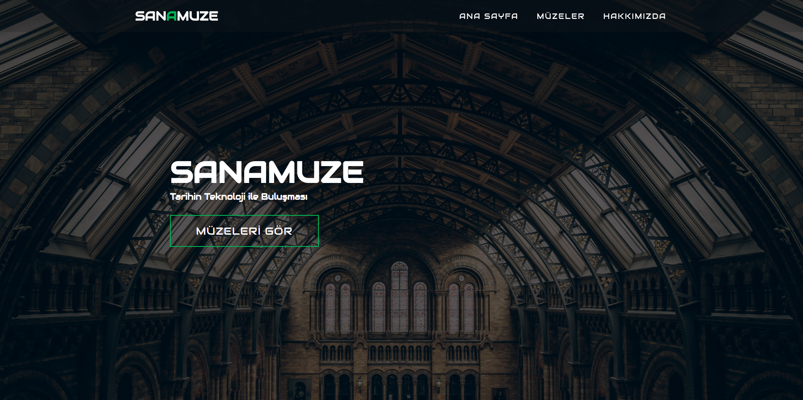

# SanAmuze Mobile App

This is a website for sanAmuze. You can visit the museums with a 3D tour and examine the works in the museums 360.



## Getting Started

These instructions will get you a copy of the project up and running on your local machine for development and testing purposes. If you want to make a change, please use the **develop** branch and open a pull request.

### How to use
First you need to download project.
```
git clone https://github.com/teknofest-2021/sanamuze-muze-website.git
```
Now you can start ``index.html``

## Built with

* [HTML](https://tr.wikipedia.org/wiki/HTML) - HyperText Markup Language
* [CSS](https://tr.wikipedia.org/wiki/CSS) - Cascading Style Sheets
* [JavaScript](https://www.javascript.com/) - Programming Language
* No external libraries were used in this project

## Authors

* **Ramazan Kaan Yarayan** - [Github](https://github.com/rknyryn)
* **Fehmi Şener** - [Github](https://github.com/fehmiisener)

See also the list of [contributors](https://github.com/teknofest-2021/sanamuze-mobile-app/contributors) who participated in this project.

## Acknowledgments

* Dear Teachers
* Teknofest Executives
* All Team Members
